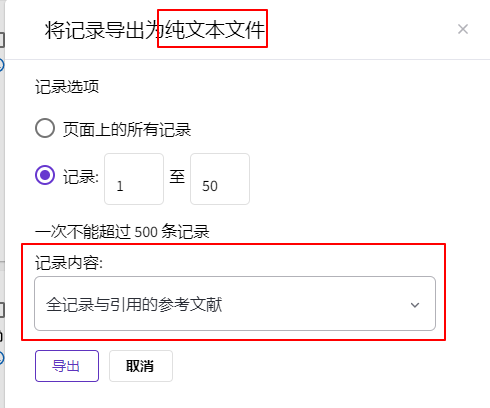

# Wos核心数据集批量下载油猴脚本

## 使用说明

安装脚本后，进入wos的核心合集检索结果页，即可在右上角看到「一键下载」按钮，点击等待下载完成即可。

## 功能说明

以一定时间间隔，从wos数据库下载wos核心数据集，每次下载数量为500条，直到下载完或出错为止。

- 格式：以纯文本方式
- 记录内容：全记录与引用的参考文献

相当于下图操作：

## 参考资料

- [抓取Web of Science经验分享](https://blog.51cto.com/u_15072778/3578042)
