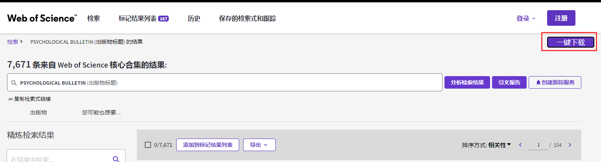
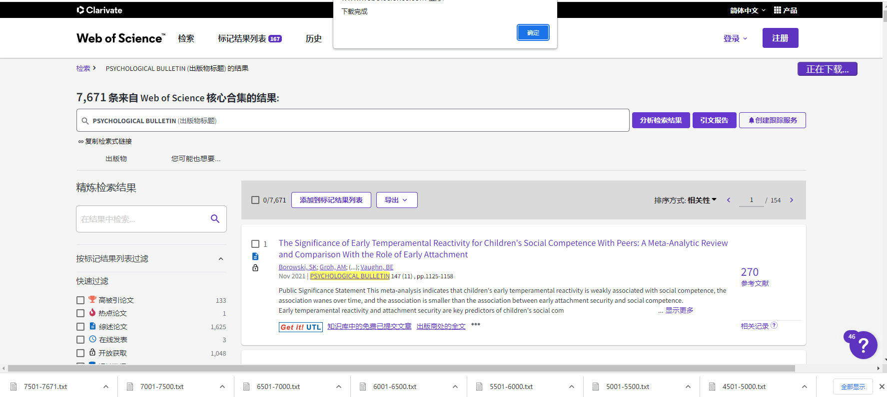

# Wos下载机器人

https://greasyfork.org/zh-CN/scripts/448810-wos-download-bot

## 功能说明

- 批量下载wos核心论文集全部数据
- 以条数重命名下载的文件

支持2022年版本的wos。安装脚本后，进入wos的核心合集检索结果页，即可在右上角看到「一键下载」按钮，点击后按提示输入下载间隔时间，最后等待下载完成即可。

以一定时间间隔，从wos数据库下载wos核心数据集，每次下载数量为500条，直到下载完或出错为止。

- 格式：以纯文本方式
- 记录内容：全记录与引用的参考文献

## 使用步骤

1、登录wos。

2、按下面规则进行检索，进入检索结果页面。注意是核心合集，按出版物标题检索，页面不正确不会显示下面的按钮。

![检索页]](images/search.png)

3、在右上角会出现「一键下载」的按钮，点击下载即可自动下载该期刊的所有论文。如果没出现该按钮可以刷新一下当前页面。

4、下载结束后会出现「下载完成」的提示。

## 注意事项

- 因为有环境检测，下载过程中建议时不时随意移动下鼠标，不要一直保持静止
- 可能会出现人机认证的要求导致无法下载，这时候需要先手动下载一条数据，进行人机认证后，再点击一键下载按钮
- 使用谷歌浏览器可能会弹出请求下载多个文件的提示，点击确定即可

## 鸣谢

特别感谢[阳志平老师](https://github.com/ouyangzhiping)以及[开智学堂](https://github.com/OpenMindClub)信分十期
